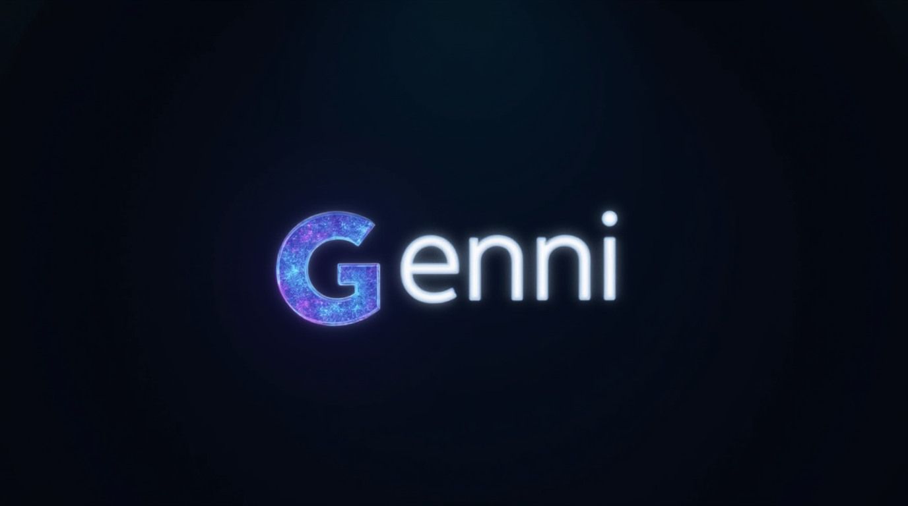
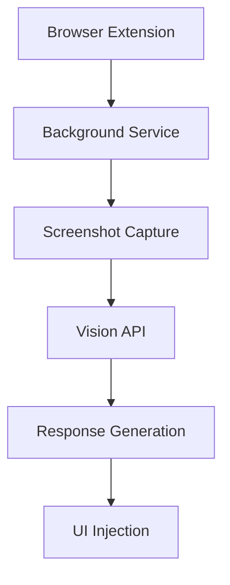

<div align="center">



[](https://opensource.org/licenses/MIT)
[](https://chrome.google.com/webstore)
[](https://microsoftedge.microsoft.com/addons)
[](http://makeapullrequest.com)
[](https://github.com/yourusername/Genni)

**Genni is your AI-powered reply companion that generates intelligent, context-aware responses using screenshot analysis and OpenAI's Vision API.**

[Installation](#-installation-guide) • [Features](#-key-features) • [Documentation](#-documentation) • [Contributing](#-contributing) • [Support](#-support)

</div>

## ✨ Why Genni?

- 🎯 **Smart & Contextual**: Understands conversation context through advanced screenshot analysis
- ⚡ **Lightning Fast**: Generate professional replies in seconds
- 🔒 **Privacy First**: Your data stays local, with secure API handling
- 🎨 **Beautiful UI**: Modern glassmorphism design that's a joy to use
- 🌐 **Cross-Platform**: Works seamlessly across major messaging platforms
- ⌨️ **Keyboard Friendly**: Quick access with customizable shortcuts

## Installation

# Install Genni:
- Clone or download the repository
- Click "Load unpacked" in your browser
- Select the src directory from the downloaded files
- Enable Developer Mode in your browser:

- Edge: Go to edge://extensions
- Chrome: Go to chrome://extensions
- Toggle "Developer mode" switch in the top right
- Configure the Extension:

- Click the Genni icon in your browser toolbar
- Open Settings and enter your OpenAI API key
- Save your settings
- Start generating smart replies!

# Basic Usage
- Navigate to any supported messaging platform
- Press Ctrl+Shift+Z or click the Genni icon
- Click "Capture Screenshot" to capture the conversation
- Click "Generate Reply" to create an AI-powered response
- Click "Insert Reply" to automatically insert the response


## 🎯 Key Features

<table>
<tr>
<td width="50%">

### 🔍 Smart Analysis
- Real-time screenshot processing
- Context-aware response generation
- Multi-platform compatibility
- Intelligent conversation parsing

</td>
<td width="50%">

### 🎨 Modern Interface
- Sleek glassmorphism design
- Intuitive controls
- Visual feedback
- Dark/Light mode support

</td>
</tr>
<tr>
<td width="50%">

### ⚙️ Customization
- Adjustable AI parameters
- Custom response templates
- Platform-specific settings
- Keyboard shortcut mapping

</td>
<td width="50%">

### 🔒 Security
- Secure API key storage
- Local screenshot processing
- HTTPS-only communication
- No permanent data storage

</td>
</tr>
</table>

## 💻 Supported Platforms

| Platform | Status | Features |
|----------|---------|-----------|
| LinkedIn | ✅ Full | Smart replies, Format preservation |
| Gmail | ✅ Full | Rich text, Template support |
| Outlook | ✅ Full | Signature integration, Threading |
| Facebook | 🟡 Basic | Message replies |
| X/Twitter | 🟡 Basic | Tweet responses |

## 🛠️ Technical Architecture



## 🔧 Advanced Configuration

```javascript
{
  "model": "gpt-4o-mini",
  "maxTokens": 500,
  "temperature": 0.7,
  "responseFormat": "json"
}
```

## 🤝 Contributing

We love your input! Check out our [Contributing Guide](CONTRIBUTING.md) to get started.

1. Fork the Project
2. Create your Feature Branch (`git checkout -b feature/AmazingFeature`)
3. Commit your Changes (`git commit -m 'Add some AmazingFeature'`)
4. Push to the Branch (`git push origin feature/AmazingFeature`)
5. Open a Pull Request

## 📈 Roadmap

- [ ] 🌍 Multi-language support
- [ ] 📝 Custom reply templates
- [ ] 🤖 Advanced AI models integration


## 📄 License

Distributed under the MIT License. See `LICENSE` for more information.

---

<div align="center">

Made with ❤️ by Traves Theberge

</div>
